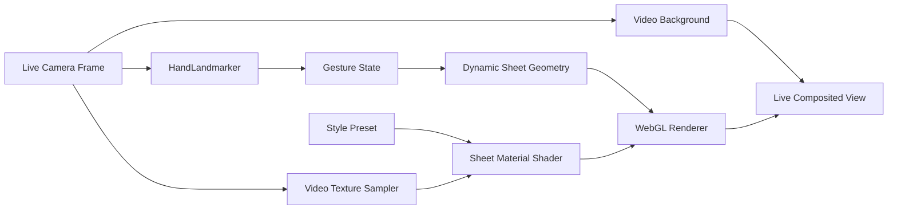

# ADR-0001: 实时场景采样光片运行时

Date: 2026-06-13

Status: Accepted

## 背景

核心需求是实时动态浏览器摄像头效果。用户不是要生成一张图片，而是要打开浏览器、授权摄像头、移动双手，并持续看到光片随手势变化。

这里的 `mask` 不是传统意义上的简单遮罩，也不是只遮挡或只显示人脸。更准确的产品术语是：

- 中文：手势驱动实时采样光片。
- 英文：Gesture-driven live-sampling light sheet。

项目名可以继续使用 `Gesture Mask Studio`，因为它短、易记；但实现文档中应把核心对象称为 `light sheet`、`video-sampling sheet` 或“实时采样光片”。

## 视频复核结论

参考视频中的光片内部会显示其背后的实时摄像头画面，并叠加不同风格：

- 蓝色技术线稿状态：光片内部可见人物、手、背景等被线稿化/蓝图化后的轮廓。
- 绿色有机状态：光片内部保留背景和人物的明暗结构，并叠加绿色纹理与黑色线条。
- 扑克牌状态：白色卡牌纹理更强，但仍不是普通 UI 遮罩；它是一个透视变形的动态面片。

人脸只是最明显的例子。实际目标是：光片覆盖到哪里，就实时采样并重新渲染那一块后方摄像头内容。

## 决策

采用实时前端渲染架构：

- 摄像头输入：浏览器 `getUserMedia`。
- 手部追踪：MediaPipe Tasks Vision `HandLandmarker`，本地 WASM 运行。
- 场景采样：将实时摄像头帧作为 WebGL video texture 输入。
- 手势引擎：把手部关键点转换为锚点、开合、旋转、置信度和光片模式。
- 渲染：Three.js/WebGL 动态三角形/四边形 mesh。
- 光片材质：同时采样实时摄像头纹理和样式纹理，将光片后方的整幅局部画面重新渲染到面片内部。

运行时输出必须是实时合成的摄像头画面，不是生成图片。



## 实时场景采样定义

光片区域内的视觉来自两类输入的组合：

1. 实时摄像头采样：
   - 根据当前屏幕坐标采样用户摄像头画面。
   - 光片经过脸、手、衣服、窗帘、植物等区域时，这些内容都应该在光片内部被重新渲染。
   - 采样结果会跟随摄像头画面每帧更新。

2. 样式预设：
   - 蓝色技术线稿：实时采样 + 边缘检测/亮度线稿 + 蓝青渐变 + 白色图纸线。
   - 扑克牌：实时采样 + 白底卡牌纹理 + 高透明/低显影的局部画面。
   - 绿色有机图案：实时采样 + 绿色纹理 + 暗色轮廓线。

首版应优先实现屏幕空间视频采样。后续如果需要更稳定的人脸线条、手部线条或人体轮廓，可以额外接入 `FaceLandmarker`、`PoseLandmarker` 或分割模型，但这些是增强输入，不是基础实现前提。

## 实时性要求

- 渲染循环使用 `requestAnimationFrame`。
- 摄像头背景保持实时更新。
- 手部追踪可低于渲染帧率，但每个渲染帧都要用最新手势状态插值。
- 光片 mesh 的顶点每帧根据手势更新。
- 光片材质每帧采样实时视频纹理，而不是使用预先生成的用户截图。

推荐目标：

- 桌面 Chrome/Edge：感知上接近 30fps 或更好。
- 手部追踪：15-30 detections/s，视设备性能降级。
- 场景采样：与 WebGL render loop 同步，每帧更新 video texture。

## 可扩展性要求

光片样式必须设计成可替换 preset，而不是写死在渲染流程里。后期新增样式时，不应改动摄像头、手部追踪和核心几何逻辑。

规范样式契约以 `runtime-contracts.md` 中的 `LightSheetStylePreset` 为唯一来源。ADR 只记录决策，不复制接口定义。

简单新增样式时只需要增加：

- 缩略图。
- 纹理图。
- preset 配置。
- 可选 shader/material 参数。

高级样式可以新增 shader variant，但必须遵守统一材质接口。

## 建议代码边界

```text
app/src/
  features/
    camera/
    hand-tracking/
    scene-sampling/
      SceneSampler.ts
      videoTexture.ts
      screenSpaceSampling.ts
    gesture-engine/
    light-sheet-renderer/
      LightSheetRenderer.ts
      geometry.ts
      materials.ts
      shaders/
    light-sheet-styles/
      presets.ts
      blueprint/
      cards/
      organic/
      index.ts
```

职责边界：

- `camera`: 只负责摄像头流。
- `hand-tracking`: 只负责手部关键点。
- `scene-sampling`: 负责实时视频纹理和屏幕空间采样。
- `gesture-engine`: 负责从手势到光片状态。
- `light-sheet-renderer`: 负责 WebGL mesh、shader、材质合成。
- `light-sheet-styles`: 负责样式配置和资产，不改变核心运行时。

## 拒绝方案

### 用 AI 图片生成作为运行时

拒绝。

原因：

- 不能满足实时手势交互。
- 不适合 GitHub Pages 静态部署。
- 延迟、成本和隐私风险都更高。
- 无法稳定响应用户每一帧手部移动。

图片生成只可用于：

- 原型图。
- 静态纹理素材。
- 后续样式概念探索。

### 只做简单遮挡或静态贴图

拒绝作为最终目标。

原因：

- 参考效果的核心是光片中能实时显影/重绘背后的摄像头内容。
- 单纯贴图覆盖无法体现“后方画面在光片内被重新渲染”的效果。

## 采用的产品方向

采用 `prototype-01-immersive-stage.png` 作为 MVP 视觉基准。

首个可运行版本优先实现：

1. 实时摄像头背景。
2. 双手驱动光片几何。
3. 光片内部采样实时摄像头纹理。
4. 蓝色技术线稿 shader，使光片覆盖区域内的人物、手、背景都可见且被风格化。
5. 再扩展扑克牌和绿色有机样式。
