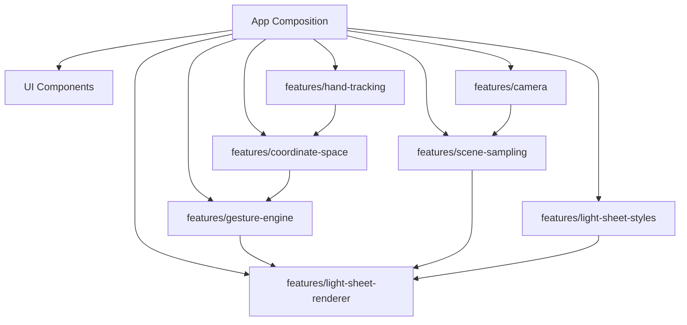

# 运行时架构契约

本文是实现阶段的硬约束。后续开发必须先满足这些契约，再写具体 UI 或渲染细节。

## 1. 统一领域语言

项目名仍为 `Gesture Mask Studio`，但代码和架构对象统一使用以下术语：

| 推荐术语 | 用途 | 禁止替代 |
|---|---|---|
| `LightSheet` / 光片 | 手势驱动的实时采样面片 | `Mask`、`Overlay`、`Card` |
| `CoordinateSpace` / 坐标空间 | 在摄像头坐标、可视显示坐标和视频 UV 坐标之间转换 | 组件内临时镜像计算 |
| `SceneSampling` / 场景采样 | 从实时摄像头画面采样光片背后的内容 | `FaceSampling`、`BackgroundOnly` |
| `GestureEngine` | 将手部关键点转换为光片状态 | `Effects`、`MagicLogic` |
| `LightSheetStylePreset` | 光片样式扩展配置 | 散落在 renderer 中的样式常量 |

例外：`Gesture Mask Studio` 作为产品名可以继续使用。

## 2. 模块依赖方向

依赖必须单向流动：



禁止依赖：

- `camera` 不得依赖 UI、renderer、gesture-engine。
- `hand-tracking` 不得依赖 renderer、scene-sampling、UI。
- `coordinate-space` 不得依赖 DOM、React、Three.js 或 MediaPipe 类型；它只能处理标准运行时类型。
- `gesture-engine` 不得依赖 MediaPipe、Three.js、DOM、React。
- `scene-sampling` 不得依赖 hand-tracking 或 gesture-engine。
- `light-sheet-styles` 不得依赖 renderer 内部实现。
- `light-sheet-renderer` 不得直接读取 React state；只能接收明确的 render input。

## 3. 公共类型契约

实现阶段必须先定义这些边界类型，并让模块通过这些类型通信。

```ts
export type NormalizedPoint = {
  x: number;
  y: number;
  z?: number;
};

export type TrackedHand = {
  id: string;
  handedness: 'left' | 'right' | 'unknown';
  confidence: number;
  landmarks: NormalizedPoint[];
};

export type LightSheetMode =
  | 'hidden'
  | 'one-hand-preview'
  | 'two-hand-sheet'
  | 'fade-out';

export type LightSheetGeometry = {
  mode: LightSheetMode;
  vertices: [NormalizedPoint, NormalizedPoint, NormalizedPoint, NormalizedPoint?];
  opacity: number;
  confidence: number;
};

export type LightSheetGestureState = {
  mode: LightSheetMode;
  confidence: number;
  stylePresetId: string;
  anchors: {
    left: NormalizedPoint;
    right?: NormalizedPoint;
  };
  openness: number;
  rotation: number;
};

export type SceneSamplingInput = {
  video: HTMLVideoElement;
  mirrored: boolean;
  viewport: { width: number; height: number };
};

export type LightSheetRenderInput = {
  geometry: LightSheetGeometry;
  style: LightSheetStylePreset;
  scene: SceneSamplingInput;
  timestampMs: number;
  debug?: boolean;
};
```

坐标映射约束：

- 可见几何使用 `display-space`，其中 `y = 0` 表示画面顶部，`y = 1` 表示画面底部。
- WebGL 顶点位置转换使用 `clipY = 1 - displayY * 2`。
- Three.js 视频纹理采样使用 `videoV = 1 - displayY`。
- 水平镜像只影响 `x` 方向；不得把水平镜像修复和垂直 UV 翻转混在同一职责里。

## 4. 样式扩展契约

新增光片样式只允许通过 `LightSheetStylePreset` 接入。不能在 renderer 中写 `if style === 'newStyle'` 的分支来堆功能。

```ts
export interface LightSheetStylePreset {
  id: string;
  label: string;
  thumbnailUrl: string;
  textureUrl?: string;
  shader: 'blueprint' | 'cards' | 'organic' | 'custom';
  opacity: number;
  edgeColor: string;
  edgeWidth: number;
  sceneSample: {
    enabled: boolean;
    mode: 'raw' | 'edge-lines' | 'luma-map' | 'posterized';
    intensity: number;
    tint: string;
  };
  highlight: {
    enabled: boolean;
    intensity: number;
    speed: number;
  };
  blendMode: 'normal' | 'screen' | 'additive';
}
```

新增普通样式的步骤：

1. 添加缩略图和纹理资产。
2. 在 `light-sheet-styles/presets.ts` 增加 preset。
3. 如果现有 shader 不满足，再新增 shader variant。
4. 为 preset 解析和默认值补测试。

## 5. 功能扩展接入点

### 新增光片样式

只改：

- `features/light-sheet-styles/`
- 可选 `features/light-sheet-renderer/shaders/`
- 样式测试

不得改：

- `features/camera/`
- `features/hand-tracking/`
- `features/gesture-engine/`

### 新增手势规则

只改：

- `features/gesture-engine/`
- 手势状态机测试

不得改：

- `features/light-sheet-renderer/` 的材质实现
- `features/camera/`

### 新增截图或录制

通过 composition 层读取最终 canvas，不得把截图逻辑塞进 renderer 内部。

### 新增人脸、姿态或分割模型

通过独立模块提供增强输入：

```text
features/vision-extensions/
  face-landmarks/
  pose-landmarks/
  segmentation/
```

增强输入只能补充 render input 或 sampling metadata，不能成为 `scene-sampling` 的基础前提。基础版本必须只靠实时视频采样运行。

## 6. 性能预算

首版必须遵守：

- camera input 默认不高于 1280x720。
- tracking 频率可独立于 render 频率，最低可降到 12fps。
- renderer 每帧不得重新创建 Three.js scene、camera、material、texture。
- style preset 切换时可以重建 material；普通帧更新只能更新 uniforms/geometry。
- video texture 每帧更新，但纹理对象本身应复用。

## 7. 测试边界

实现阶段必须优先覆盖：

- `gesture-engine`: 两手、一手、丢失、交叉、低置信度。
- `coordinate-space`: 镜像和非镜像显示坐标转换，且不得修改输入 tracking 结果。
- `light-sheet-renderer/geometry`: 四边形、三角退化、镜像坐标。
- `light-sheet-styles`: preset schema、默认值、非法配置。
- `scene-sampling`: video texture 输入、viewport/mirror 坐标映射。
- `camera`: 权限拒绝、无设备、停止流。

不允许只靠浏览器手工验证通过。

## 8. 架构变更规则

出现以下情况必须新增 ADR：

- 新增运行时依赖，如新的视觉模型、渲染库、状态库。
- 改变模块依赖方向。
- 改变 `LightSheetStylePreset` 或 `LightSheetRenderInput` 的兼容性。
- 把静态部署改成需要后端服务。
- 引入录制、上传、账号、云端推理等跨边界能力。
