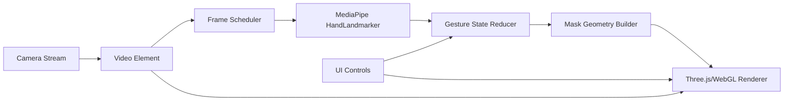

# Gesture Mask Studio 技术架构方案

## 1. 总体结论

推荐使用纯前端静态应用实现：

- 前端框架：React + Vite + TypeScript。
- 摄像头：浏览器 `navigator.mediaDevices.getUserMedia`。
- 手部识别：MediaPipe Tasks Vision `HandLandmarker`。
- 渲染：Three.js 或自定义 WebGL；首选 Three.js，降低开发复杂度。
- 状态管理：React state + 小型 reducer；首版不引入大型状态库。
- 部署：GitHub Pages，可行。

这个方案不需要后端 GPU，也不需要 NVIDIA 推理服务。NVIDIA 相关能力可在后续做本地/云端高级视觉模型时再评估；当前目标用 MediaPipe WASM 更轻、更适合个人开发者部署。

## 2. 一页式应用结构

```text
gesture-mask-studio/
  CODEX_DOC/
    progress.md
  docs/
    analysis/
      video-effect-analysis.md
    product/
      requirements-and-business-logic.md
    architecture/
      technical-architecture.md
    deployment/
      github-pages-evaluation.md
  assets/
    video-frames/
    design/
  app/                         # 后续实现阶段创建
    package.json
    index.html
    src/
      main.tsx
      App.tsx
      features/camera/
      features/hand-tracking/
      features/mask-renderer/
      features/effects/
      components/
      styles/
      assets/textures/
```

本阶段只规划，不创建 `app/` 代码目录。待原型图方向确认后再进入实现。

## 3. 运行时数据流



### 关键原则

- 摄像头画面和手势识别都在本地浏览器执行。
- 每一帧先更新视频，再按设定频率运行手部识别。
- 手部关键点经过平滑滤波后再生成面片几何。
- WebGL 负责把纹理映射到动态三角形/四边形。
- UI 控制只改变渲染参数和业务状态，不阻塞识别线程。

## 4. 核心模块设计

### `features/camera`

职责：

- 请求摄像头权限。
- 管理视频流生命周期。
- 提供摄像头可用、加载、拒绝、停止等状态。
- 支持镜像显示。

主要接口：

```ts
type CameraState = 'idle' | 'requesting' | 'ready' | 'denied' | 'unavailable' | 'error';

interface CameraController {
  start(): Promise<void>;
  stop(): void;
  videoElement: HTMLVideoElement | null;
  state: CameraState;
}
```

### `features/hand-tracking`

职责：

- 加载 MediaPipe `HandLandmarker`。
- 以可配置频率识别视频帧。
- 输出最多两只手的标准化关键点。
- 处理模型加载失败和低性能降级。

主要输出：

```ts
interface TrackedHand {
  id: string;
  handedness: 'Left' | 'Right' | 'Unknown';
  confidence: number;
  landmarks: Array<{ x: number; y: number; z: number }>;
}
```

### `features/effects`

职责：

- 将手部关键点转换为业务手势状态。
- 判断一只手预览、双手面片、丢失淡出、自动切换纹理等状态。
- 对关键点做平滑处理。

核心输出：

```ts
interface MaskGestureState {
  mode: 'hidden' | 'one-hand-preview' | 'two-hand-sheet' | 'fade-out';
  confidence: number;
  texturePreset: 'blueprint' | 'cards' | 'organic';
  anchors: {
    left: { x: number; y: number };
    right?: { x: number; y: number };
  };
  openness: number;
  rotation: number;
}
```

### `features/mask-renderer`

职责：

- 初始化 Three.js renderer、scene、orthographic camera。
- 生成动态 BufferGeometry。
- 加载纹理。
- 绘制半透明面片、边缘高光、扫描光或反光线。
- 可选绘制调试关键点。

渲染策略：

- 背景层：实时视频。
- 效果层：WebGL canvas 透明叠加。
- UI 层：React DOM 控制条。

## 5. 几何和视觉实现

### 面片顶点

双手状态下使用四边形：

```text
topLeft ---- topRight
  |            |
bottomLeft - bottomRight
```

当手势让一侧厚度接近 0 时，退化为三角形或窄梯形，以模拟参考视频中的尖角效果。

### 视觉材质

- `opacity`: 0.72-0.9，按纹理不同调整。
- `edge`: 白色外边线，1-3px 等效宽度。
- `highlight`: 沿长轴或对角线移动的半透明白色光带。
- `blend`: 默认 `normal` 或轻微 `screen` 风格；WebGL 中通过 shader 控制。

## 6. 性能策略

- 摄像头输入建议 640x480 起步。
- 手部识别建议 20-30fps，低性能下降到 12-15fps。
- 渲染保持 `requestAnimationFrame`。
- 使用上一帧识别结果插值，避免识别帧率下降时画面卡顿。
- 模型和纹理延迟加载；首屏先显示启动状态。

## 7. 测试策略

### 单元测试

- 手势状态机。
- 顶点几何计算。
- 纹理选择规则。
- 摄像头错误状态映射。

工具：Vitest。

### 浏览器验证

- Chrome/Edge 桌面摄像头授权流程。
- 摄像头拒绝流程。
- 两只手识别后面片出现。
- 镜像开关。
- 纹理切换。
- 移动端布局。

工具：手工测试 + Playwright 截图检查。真实摄像头交互需要人工验证或 mock video stream。

## 8. 技术风险

- GitHub Pages 是静态托管，不能处理服务端模型推理；本方案不依赖后端，因此可行。
- GitHub Pages 的 HTTPS 支持满足摄像头权限要求。
- MediaPipe 模型文件需要正确配置静态路径或 CDN 路径。
- iOS Safari 对摄像头、WebGL、WASM 性能更敏感，首版优先保证桌面 Chrome/Edge。
- 精确遮挡需要额外分割模型，会增加性能成本，首版只做轻量遮挡或不做。

## 9. 推荐实施阶段

1. 原型确认：完成一张主体验界面原型图和关键交互说明。
2. 工程初始化：创建 React + Vite + TypeScript 项目。
3. 摄像头层：完成授权、预览、错误状态。
4. 手部识别层：接入 MediaPipe，显示调试关键点。
5. 面片渲染层：实现 WebGL 动态面片和纹理。
6. 手势业务层：实现双手拉伸、单手预览、丢失淡出。
7. 视觉打磨：边缘高光、透明度、三种纹理、基础遮挡。
8. 部署验证：GitHub Pages HTTPS 摄像头访问测试。
