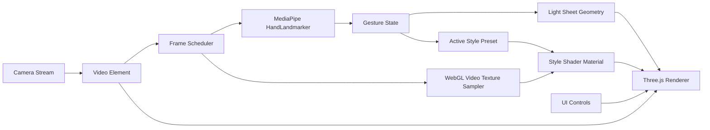

# Gesture Mask Studio 技术架构方案

English version: [technical-architecture.md](technical-architecture.md)

## 1. 总体结论

推荐使用纯前端静态应用实现：

- 前端框架：React + Vite + TypeScript。
- 摄像头：浏览器 `navigator.mediaDevices.getUserMedia`。
- 手部识别：MediaPipe Tasks Vision `HandLandmarker`。
- 场景采样：将实时摄像头帧作为 WebGL video texture，在光片内部重新采样并渲染背后的实时画面。
- 渲染：Three.js/WebGL。
- 状态管理：React state 和局部 reducer；首版不引入大型状态库。
- 部署：GitHub Pages。

当前目标不需要后端 GPU，也不需要 NVIDIA 推理服务。MediaPipe WASM + WebGL 更轻量，更适合个人开发者部署。

## 2. 应用结构

```text
gesture-mask-studio/
  CODEX_DOC/
    progress.md
  docs/
    analysis/
    product/
    architecture/
    deployment/
    verification/
  app/
    package.json
    index.html
    src/
      main.tsx
      App.tsx
      components/
      features/
        camera/
        hand-tracking/
        gesture-engine/
        scene-sampling/
        light-sheet-renderer/
        light-sheet-styles/
      shared/runtime/
      styles/
      assets/textures/
```

## 3. 运行时数据流



关键原则：

- 摄像头画面和手势识别都在浏览器本地执行。
- 手部关键点经标准化后进入手势引擎。
- 手势引擎只输出领域状态和几何，不依赖 DOM、MediaPipe 或 Three.js。
- WebGL 负责把摄像头视频采样、样式纹理、边缘线和高光映射到动态几何上。
- 样式默认由手势引擎根据手部开合状态自动选择。
- UI 控制只负责摄像头、镜像和状态展示，不要求用户手动切换样式。

## 4. 核心模块

### `features/camera`

职责：

- 请求摄像头权限。
- 管理媒体流生命周期。
- 提供 `idle`、`requesting`、`ready`、`denied`、`unsupported`、`error` 状态。
- 停止时释放所有 media tracks。

### `features/hand-tracking`

职责：

- 封装 MediaPipe Tasks Vision。
- 动态加载 `@mediapipe/tasks-vision`，避免首屏 bundle 过大。
- 对外只暴露标准 `TrackedHand`，不泄漏 MediaPipe 类型。
- 支持后续替换模型或引擎。

### `features/gesture-engine`

职责：

- 将 `TrackedHand[]` 转换成 `LightSheetGestureState`。
- 构建一只手预览和双手光片几何。
- 处理置信度、左右排序、手部张开程度和旋转角。
- 在未提供调试/手动覆盖时，根据手势开合度输出当前 `stylePresetId`。

### `features/scene-sampling`

职责：

- 将屏幕归一化坐标映射到视频 UV。
- 支持镜像和非镜像采样。
- 提供视频是否可渲染的纯 DOM 判断。

### `features/light-sheet-renderer`

职责：

- 通过 Three.js 创建 WebGL renderer。
- 使用摄像头视频纹理。
- 根据几何生成 position、uv 和 index buffer。
- 在 shader 中处理采样、色调、高光、边缘和透明度。

### `features/light-sheet-styles`

职责：

- 管理 `LightSheetStylePreset`。
- 当前预设：
  - Blueprint；
  - Cards；
  - Organic。
- 新增样式时优先扩展预设，不修改核心渲染流程。

## 5. 架构边界

必须保持：

- `gesture-engine` 不导入 DOM、MediaPipe、Three.js。
- `hand-tracking` 不影响样式或渲染。
- `light-sheet-renderer` 不知道手势识别细节。
- `light-sheet-styles` 只提供配置，不拥有运行时状态。
- `components` 作为组合层，可以连接各模块，但不应承载复杂算法。

## 6. 性能策略

- MediaPipe 动态导入。
- Three.js 光片画布按需懒加载。
- MediaPipe wasm 本地静态托管，避免第三方 CDN 失败。
- 渲染循环只在摄像头可用时运行。
- 后续可增加低性能模式：降低手势识别频率、输入分辨率或 shader 复杂度。

## 7. 部署策略

使用 GitHub Pages：

- Vite `base` 配置为 `/gesture-mask-studio/`。
- workflow 构建 `app/dist`。
- wasm 文件复制到 `dist/mediapipe/wasm`。
- Pages 使用 `workflow` 模式部署。

## 8. 后续扩展点

- 新样式：添加 `LightSheetStylePreset`。
- 新手势：扩展 `gesture-engine`，保持输入/输出契约不变。
- 截图/录制：新增独立功能模块，不嵌入渲染核心。
- 调试层：作为可开关组件读取运行时状态。
- 高级遮挡：新增 scene segmentation 模块，不替换现有采样架构。
