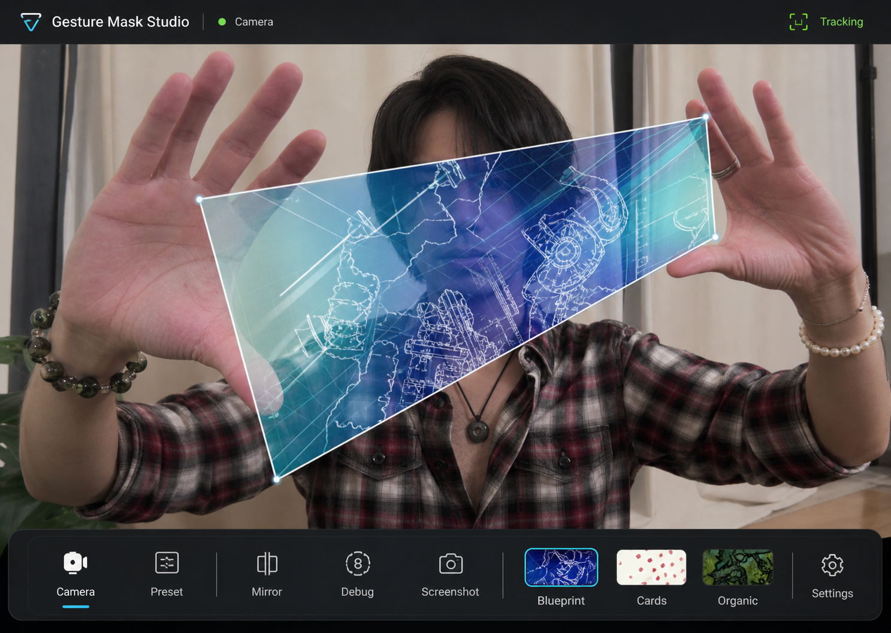
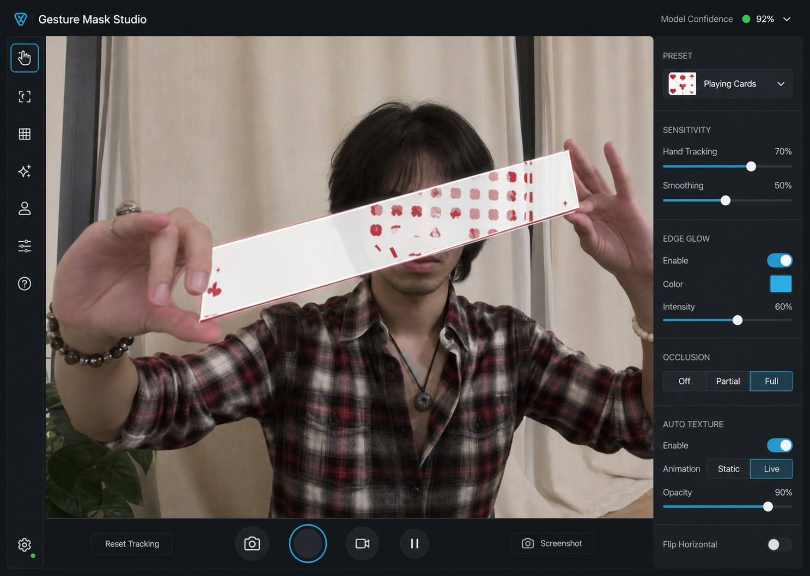
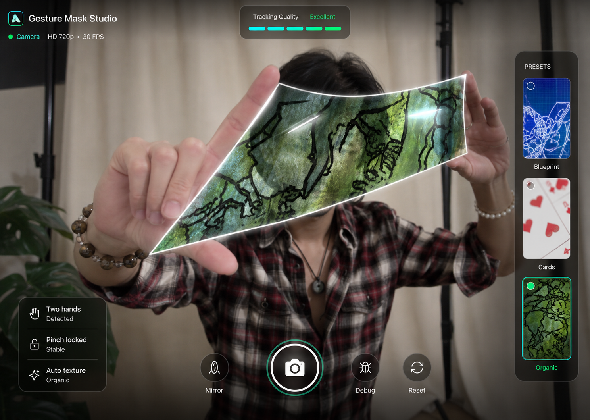

# Product Design 原型图方向

本阶段基于 `docs/analysis/video-effect-analysis.md` 的抽帧观察生成 3 个 Product Design 原型方向。三张图已复制到项目内：

- `assets/design/prototype-01-immersive-stage.png`
- `assets/design/prototype-02-precision-tool.png`
- `assets/design/prototype-03-performance-lens.png`

> 说明：本环境的 Image Gen 调用无法直接把本地抽帧作为附件传入，因此原型图使用了已人工检查的抽帧事实作为提示词依据。生成结果已在本机保存并复制进项目目录。

## 设计简报

目标界面是一页式实时摄像头应用，不做营销落地页。用户进入页面后启动摄像头，通过双手把半透明纹理面片拉伸、旋转、压缩，形成类似参考视频中的手势蒙版效果。

必须保留：

- 摄像头画面为第一视觉焦点。
- 双手和面片在画面中央直接可见。
- 面片要有透视变形、白色边缘、高光、透明材质。
- 至少表现蓝色技术线稿、白底红色扑克牌、绿色有机图案三类纹理。
- UI 控制必须少而清晰，不遮挡主要手势区域。

## 方向 1：Immersive Stage

特点：

- 全屏摄像头舞台，底部是一条紧凑控制 dock。
- 顶部只保留产品名、摄像头状态和 Tracking 状态。
- 面片为蓝色技术线稿大梯形，最接近参考视频中最有记忆点的蓝色效果。
- 纹理预设以小缩略图形式放在底部，用户容易理解。

适合：

- MVP 首版。
- 作品集演示。
- 普通用户打开即用。

风险：

- 底部 dock 较高，移动端需要重排。
- 高级参数入口较弱。

建议：首版优先采用该方向。

## 方向 2：Precision Tool

特点：

- 更像专业创作工具。
- 左侧工具栏和右侧参数面板较完整。
- 重点呈现扑克牌长条效果，对应参考视频中的白色卡牌纹理阶段。
- 提供 Sensitivity、Smoothing、Edge Glow、Occlusion、Auto Texture 等可调项。

适合：

- 后续调参版。
- 开发调试模式。
- 面向高级用户的控制台。

风险：

- 首屏控件较多，会削弱“打开即玩”的体验。
- 右侧参数面板需要较多交互实现。

建议：作为第二阶段的 Advanced Mode，而不是 MVP 默认界面。

## 方向 3：Performance Lens

特点：

- HUD 风格，控件直接叠在摄像头画面上。
- 右侧预设轨道展示三种纹理缩略图。
- 绿色有机面片表现好，三角/梯形形态接近参考视频后半段。
- 底部圆形拍摄按钮更偏“相机/滤镜应用”。

适合：

- 更偏消费级滤镜体验。
- 后续加入截图/录制功能。
- 移动端产品方向。

风险：

- HUD 控件如果实现不好，容易遮挡手部。
- 相机按钮可能让用户误解首要目标是拍照，而不是实时互动。

建议：可吸收右侧预设轨道和底部手势状态，但不作为首版整体布局。

## 首版推荐方案

采用方向 1 `Immersive Stage` 作为 MVP 视觉基准，并吸收方向 3 的两个局部设计：

- 右侧或底部使用真实纹理缩略图选择预设。
- 保留简短手势状态，如 `Two hands`、`Pinch locked`、`Tracking`。

方向 2 的高级参数暂时收进设置面板或调试模式，避免 MVP 变成复杂工具台。

## 后续实现约束

- 不使用营销式 hero 或说明卡片。
- 首屏必须是摄像头/效果舞台。
- 控件必须真实可交互：
  - 启动/停止摄像头。
  - 预设切换。
  - 镜像。
  - 调试关键点。
  - 截图或重置。
- UI 文案应保持短标签，避免遮挡画面。
- 最终实现需要用浏览器截图与选中原型图对比，重点检查面片位置、控件密度、边缘高光、透明度和纹理缩略图。
