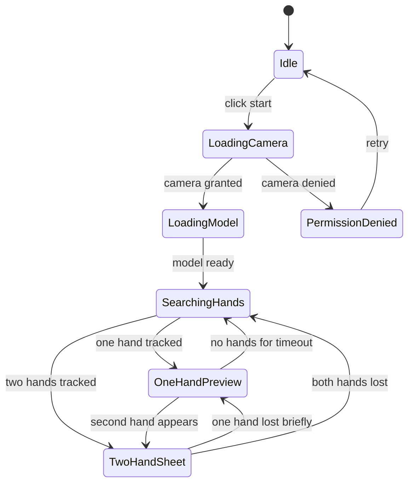

# Gesture Mask Studio 需求与业务逻辑

## 1. 项目定位

项目名称：`Gesture Mask Studio`

目标：新增一个浏览器单页应用。用户访问链接后授权摄像头，在实时画面中通过双手姿态生成类似参考视频的“手势驱动实时采样光片”效果：一张半透明光片被手势拉伸、旋转、压缩，光片内部实时采样并重新渲染其背后的摄像头画面，同时在不同视觉纹理之间切换。

首版不是视频编辑器，也不是上传视频处理工具，而是实时互动摄像头体验。

说明：`mask` 可以保留在项目英文名里，但它不是简单遮挡层。后续文档中优先使用“光片”或“实时采样光片”描述核心效果。

## 2. 目标用户

- 个人开发者：需要一个可部署、可展示、可继续扩展的 Web 项目。
- 普通访问用户：打开页面即可体验，不需要注册、安装客户端或配置后端。
- 后续演示/作品集观看者：通过 GitHub Pages 或类似静态托管访问体验。

## 3. 核心用户流程

1. 用户打开页面。
2. 页面显示摄像头授权引导和启动按钮。
3. 用户点击启动并授权摄像头。
4. 应用加载手部识别模型。
5. 摄像头画面铺满主舞台。
6. 当检测到一只手时，显示小型三角预览或手势提示。
7. 当检测到两只手时，在双手之间生成半透明实时采样光片。
8. 光片内部采样其覆盖区域背后的实时摄像头画面，并做风格化渲染。
9. 用户移动、张开、旋转双手，光片实时伸缩、旋转、透视变形。
10. 用户通过手势或界面控件切换蓝色线稿、扑克牌、绿色图案等纹理。
11. 用户可关闭调试层、切换镜像、暂停摄像头或重置效果。

## 4. 功能范围

### MVP 必须实现

- 单页浏览器访问。
- 摄像头授权和本地实时预览。
- 浏览器端手部关键点识别，支持最多两只手。
- WebGL 绘制动态三角形/四边形实时采样光片。
- 光片内部必须实时采样被覆盖区域背后的摄像头画面，使人物、手、衣服、背景等内容在光片内被重新渲染/风格化显示。
- 至少 3 种纹理预设：
  - 蓝色技术线稿。
  - 白底红色扑克牌图案。
  - 绿色有机图案。
- 光片跟随双手移动、缩放、旋转、倾斜。
- 白色边缘高光和半透明质感。
- 蓝色技术线稿样式中，应优先体现被覆盖画面的轮廓/线稿显影，而不是只覆盖蓝色贴图。
- UI 控制：
  - 启动/停止摄像头。
  - 纹理预设选择。
  - 镜像开关。
  - 调试关键点开关。
  - 识别状态/置信度提示。
- 摄像头不可用或权限拒绝时显示可恢复提示。

### 首版增强项

- 简单手指遮挡模拟：在面片顶点附近重绘小范围手指遮挡，使面片更像被夹住。
- 根据手势自动切换纹理。
- 低性能模式：降低识别频率和渲染分辨率。
- 截图按钮：保存当前画面为 PNG。

### 暂不进入首版

- 账号系统。
- 后端服务。
- 视频录制和上传。
- 社交分享后端。
- 精确人体/手掌分割。
- 多人同时互动。

## 5. 手势业务逻辑

### 输入数据

每帧输入：

- 摄像头视频帧。
- 0-2 只手的 21 点关键点。
- 每只手的 handedness 和置信度。
- 上一帧的光片状态。

关键点优先使用：

- `thumb_tip`：拇指尖。
- `index_tip`：食指尖。
- `middle_tip`：中指尖，用于辅助判断开掌/方向。
- `wrist`：手腕，用于辅助判断手部朝向和稳定性。

### 光片内容渲染规则

光片不是静态图片，也不是简单遮挡。每一帧渲染时必须：

1. 将当前摄像头帧作为 WebGL video texture。
2. 根据光片在屏幕上的几何位置采样其背后的实时画面。
3. 将采样结果映射到光片的三角形/四边形面片中。
4. 叠加当前样式的纹理、颜色映射、边缘线、高光和透明度。
5. 输出实时合成画面。

人脸只是采样内容中的一个典型对象。衣服、手、窗帘、植物等背景元素也应该在光片内部被实时重渲染。

### 手势状态

### 光片几何规则

1. 双手均可用时：
   - 左右两个主锚点使用每只手的“捏合中心”，即拇指尖和食指尖的中点。
   - 主轴为左右锚点连线。
   - 光片长度等于两锚点距离。
   - 光片厚度根据手指张开程度和距离比例计算。
   - 手部旋转影响光片顶点偏移，从而形成梯形或三角形。

2. 一只手可用时：
   - 光片退化为较小的三角预览。
   - 光片位置跟随该手的食指/拇指区域。
   - UI 提示“再伸出另一只手以拉伸光片”。

3. 手丢失时：
   - 300ms 内保持上一帧位置并淡出，避免闪烁。
   - 超过 300ms 进入搜索状态。

### 纹理切换规则

为保证可重复使用，首版采用“控件优先，手势辅助”的规则：

- 用户可以直接通过底部预设选择器切换纹理。
- 可选自动模式：
  - 双手距离较短：扑克牌长条。
  - 双手距离中等且张开：绿色图案。
  - 双手距离较长或快速拉伸：蓝色技术线稿。

自动模式必须可关闭，避免用户无法理解为什么纹理变化。

## 6. 异常与降级

- 摄像头权限拒绝：显示重新授权说明，提供重试按钮。
- 没有摄像头：显示设备不可用状态。
- 模型加载失败：提示刷新或检查网络/CDN。
- 性能不足：自动降低输入分辨率和手部识别频率。
- 只检测到一只手：不报错，显示一只手预览。
- 双手交叉或识别左右手混乱：按屏幕 x 坐标重新排序锚点。

## 7. 可验收标准

- 在桌面 Chrome/Edge 中，用户授权摄像头后可以看到实时画面。
- 双手进入画面后 1 秒内出现面片。
- 光片能随双手移动、旋转、伸缩，不出现明显卡死。
- 当光片覆盖人物或背景时，光片内部能看到被风格化处理的实时摄像头内容，而不是单纯遮住或盖住画面。
- 参考视频中的三类视觉纹理都能被模拟。
- 页面可通过 HTTPS 静态托管访问。
- 项目结构清晰，后续可继续扩展截图、录制、更多手势和更精确遮挡。
