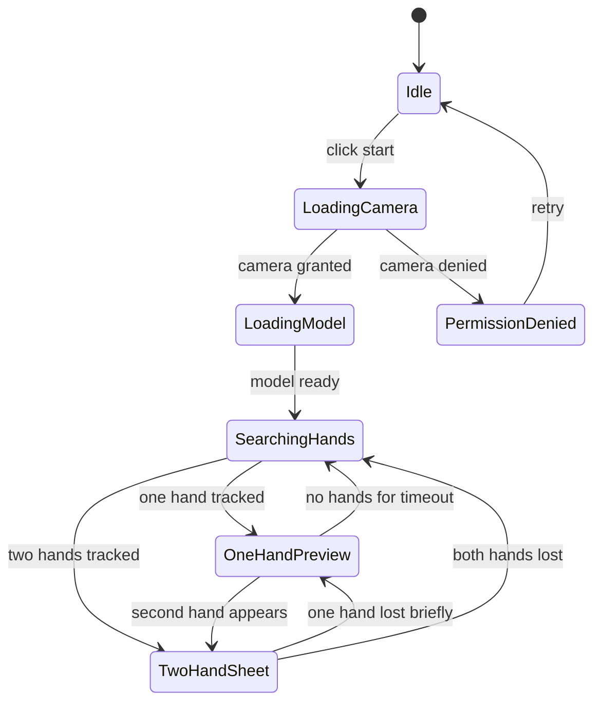

# Gesture Mask Studio 需求与业务逻辑

English version: [requirements-and-business-logic.md](requirements-and-business-logic.md)

## 1. 项目定位

项目名称：`Gesture Mask Studio`

目标：新增一个浏览器单页应用。用户访问链接后授权摄像头，在实时画面中通过双手姿态生成类似参考视频的“手势驱动实时采样光片”效果：一张半透明光片被手势拉伸、旋转、压缩，光片内部实时采样并重新渲染其背后的摄像头画面，同时根据手势状态自动切换多种视觉纹理。

首版不是视频编辑器，也不是上传视频处理工具，而是实时互动摄像头体验。

说明：`mask` 可以保留在英文项目名中，但它不是简单遮挡层。后续中文文档优先使用“光片”或“实时采样光片”描述核心效果。

## 2. 目标用户

- 个人开发者：需要一个可部署、可展示、可持续扩展的 Web 项目。
- 普通访问用户：打开页面即可体验，不需要注册、安装客户端或配置后端。
- 后续作品集/演示观看者：通过 GitHub Pages 或类似静态托管访问体验。

## 3. 核心用户流程

1. 用户打开页面。
2. 页面显示摄像头授权引导和启动按钮。
3. 用户点击启动并授权摄像头。
4. 应用加载手部识别模型。
5. 摄像头画面铺满主舞台。
6. 检测到一只手时，显示小型预览几何或跟踪提示。
7. 检测到两只手时，在双手之间生成半透明实时采样光片。
8. 光片内部采样其覆盖区域背后的实时摄像头画面，并做风格化渲染。
9. 用户移动、张开、旋转双手，光片实时伸缩、旋转、透视变形。
10. 应用根据手势状态自动切换蓝色线稿、扑克牌、绿色图案等预设。
11. 用户可切换镜像、停止摄像头或重试权限。

## 4. MVP 必须实现

- 单页浏览器访问。
- 摄像头授权和本地实时预览。
- 浏览器端手部关键点识别，最多支持两只手。
- WebGL 绘制动态三角形/四边形实时采样光片。
- 光片内部必须实时采样被覆盖区域背后的摄像头画面。
- 至少 3 种纹理预设：
  - 蓝色技术线稿；
  - 白底红色扑克牌图案；
  - 绿色有机图案。
- 光片跟随双手移动、缩放、旋转、倾斜。
- 白色边缘高光和半透明质感。
- UI 控件：
  - 启动/停止摄像头；
  - 当前自动样式状态；
  - 镜像开关；
  - 识别状态提示。
- 摄像头不可用或权限拒绝时，显示可恢复提示。

## 5. 首版增强项

- 低性能模式：降低识别频率和渲染分辨率。
- 截图按钮：保存当前画面为 PNG。
- 调试层：显示关键点、置信度和几何顶点。

## 6. 暂不进入首版

- 账号系统。
- 后端服务。
- 视频录制和上传。
- 社交分享后端。
- 精确人体/手掌分割。
- 多人同时互动。

## 7. 光片内容渲染规则

光片不是静态图片，也不是简单遮挡。每一帧渲染必须：

1. 将当前摄像头帧作为 WebGL video texture。
2. 根据光片在屏幕上的几何位置采样其背后的实时画面。
3. 将采样结果映射到光片三角形/四边形中。
4. 叠加当前样式的纹理、颜色映射、边缘线、高光和透明度。
5. 输出实时合成画面。

人脸只是采样内容中的一个典型对象；衣服、手、窗帘、植物等背景元素也应在光片内部被实时重渲染。

## 8. 手势状态

## 9. 几何规则

双手可用时：

- 左右两个主锚点使用每只手的“捏合中心”，即拇指尖和食指尖的中点。
- 主轴为左右锚点连线。
- 光片长度等于两锚点距离。
- 光片厚度根据手指张开程度和距离比例计算。
- 光片顶点可偏移形成梯形或三角形。

一只手可用时：

- 光片退化为较小三角预览。
- 位置跟随该手的食指/拇指区域。
- UI 可提示用户伸出另一只手以拉伸光片。

手丢失时：

- 短时间内保持上一帧位置并淡出，避免闪烁。
- 超时后进入搜索状态。

## 10. 纹理切换规则

首版采用“手势优先”的自动规则：

- 无手或一只手：默认显示 Blueprint 状态，作为搜索/预览态。
- 双手捏合程度较高：切换到 Cards 状态。
- 双手明显张开：切换到 Organic 状态。
- 双手处于中间开合区间：回到 Blueprint 状态。

底部控制栏只显示当前 `Auto` 样式状态，不要求用户手动切换预设。后续如果加入调试/专家模式，可以在独立面板中提供手动覆盖，但不作为默认体验。

## 11. 验收标准

- 桌面 Chrome/Edge 中，授权摄像头后能看到实时画面。
- 双手进入画面后 1 秒内出现光片。
- 光片能随双手移动、旋转、伸缩，不出现明显卡死。
- 光片覆盖人物或背景时，内部能看到被风格化处理的实时摄像头内容。
- 参考视频中的三类视觉纹理都能被模拟。
- 页面可通过 HTTPS 静态托管访问。
- 项目结构清晰，后续可扩展截图、录制、更多手势和更精确遮挡。
